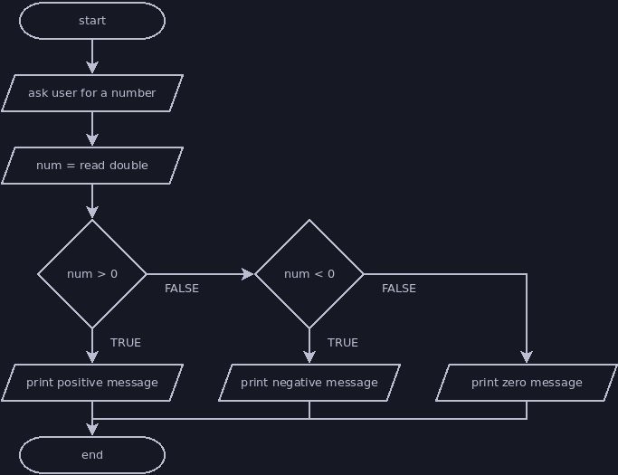
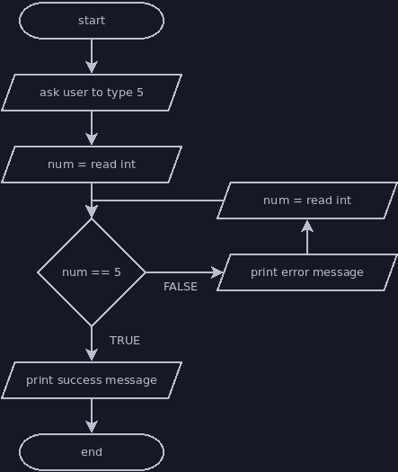

# Decision Points

Decision points allow our flowchart to branch in multiple directions, and the
condition in the decision point determines which branch we follow. All branches
must eventually converge and lead to the flowchart's end terminator.

## Symbols

A diamond shape represents a decision or branching point. The text in this
symbol states the condition, which must usually be true or false. Each branch
coming from this symbol is labelled with the result that would cause the program
to follow that branch (again, usually true and false).


## Selection vs Iteration

There are two ways we can use decision points: selection and iteration.
- **Selection**: the decision point chooses which instruction(s) to perform
next, but these do not lead back to earlier parts of the flowchart and converge
before the end terminator.
- **Iteration**: the decision point chooses whether to follow a branch that
leads back to an earlier part of the flowchart or to continue towards the end of
the flowchart. Iteration allows us to repeat instructions multiple times until a
condition is met.

In Java code, selection is handled with if statements and switch statements.
Iteration is handled with loops (while, do-while, for).

## Selection Examples

The flowcharts below demonstrate selection. The equivalent jshell scripts are
also shown after each flowchart.


```java
println("Please type the number 5.")
int five = nextInt()
if (five == 5) {
    println("Thank you for typing 5.")
} else {
    println("Error: you didn't type 5.")
}
```



```java
println("Please enter a number.")
int num = nextDouble()
if (num > 0) {
    println(num + " is a positive number.")
} else {
    if (num < 0) {
        println(num + " is a negative number.")
    } else {
        println(num + " is zero, which is neither positive nor negative.")
    }
}
```

## Iteration Examples

The flowcharts below demonstrate iteration. The equivalent jshell scripts are
also shown after each flowchart.



This flowchart duplicates an instruction to more closely match the structure of
the jshell code below.

```java
println("Please type the number 5.")
int five = nextInt()
while (five != 5) {
    println("Error: you didn't type 5. Try again.")
    five = nextInt()
}
println("Thank you for typing 5.")
```


```java
println("Please type a positive integer.")
int countdown = nextInt()
while (countdown > 0) {
    println(countdown + "!")
    --countdown
}
```
