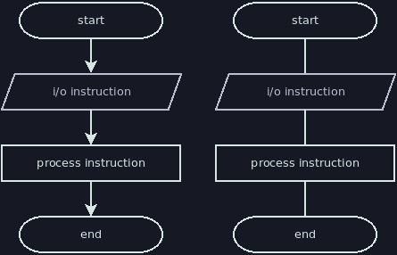
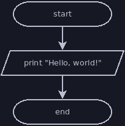
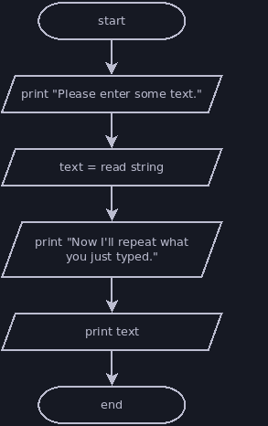
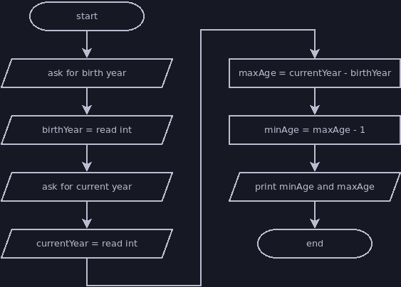

# Sequential Instructions

At its core, a flowchart is a sequence of instructions that must be followed in
order.

## Symbols

You will see most of the symbols below in any flowchart in these notes. This is
mostly redundant with the summary of symbols shown in the textbook.
- **Terminators**: the capsule shapes mark the start/end of a flowchart
- **I/O Instructions**: paralellograms indicate an instruction that performs
input or output
- **Process Instructions**: rectangtles represent most other instructions that
do not involve input or output
- **Arrows**: each part of a flowchart is connected to one or more
others by arrows
- **Lines**: if the flowchart reads left to right, top to bottom, then the
arrows can be left off the connections



## Reading a Flowchart

Beginning with the start terminator, each instruction in the flowchart is
performed in sequence. Below are several examples followed by equivalent jshell
scripts.

### Hello World



```java
println("Hello, world!")
```

### Repeat It



```java
println("Please enter some text.")
String text = nextLine()
println("Now I'll repeat what you just typed.")
println(text)
```

### Simple Age



```java
println("Please enter the year you were born.")
int birthYear = nextInt()
println("Please enter the current year.")
int currentYear = nextInt()
int maxAge = currentYear - birthYear
int minAge = maxAge - 1
println("You are either " + minAge + " or " + maxAge + " years old.")
```

Note that this last flowchart left out the details of what text the program
should print. Instead, the output instructions focused on the purpose of the
output. This is usually fine; the purpose of our flowchart is to show the
structure of our code, not specify the exact details of its input and output.
