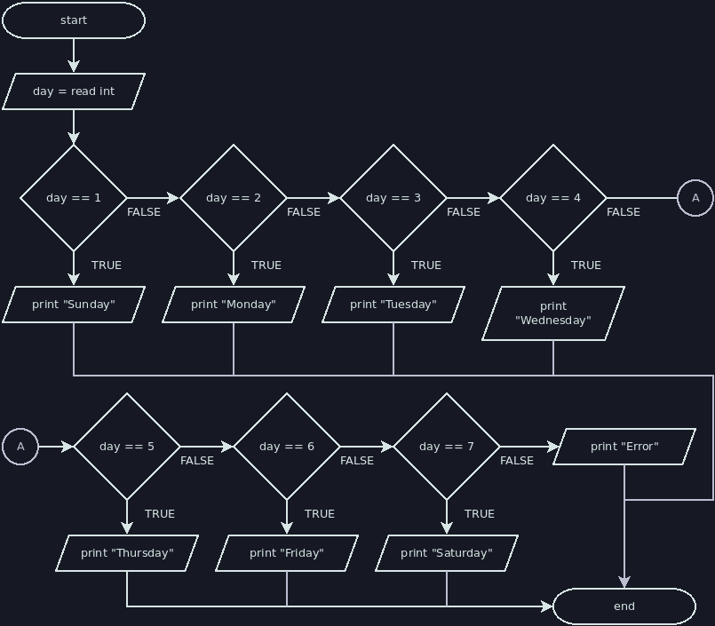

# Else-If

We'll sometimes want a conditional statement with more than two cases. For
example, what if we wanted to convert a number from 1 to 7 into a day of the
week? We could handle this with nested if-else statements, but it's not great:

```java
int day = nextInt();

if (day == 1) {
    println("Sunday");
} else {
    if (day == 2) {
        println("Monday");
    } else {
        if (day == 3) {
            println("Tuesday");
        } else {
            if (day == 4) {
                println("Wednesday");
            } else {
                if (day == 5) {
                    println("Thursday");
                } else {
                    if (day == 6) {
                        println("Friday");
                    } else {
                        if (day == 7) {
                            println("Saturday");
                        } else {
                            println("Error");
                        }
                    }
                }
            }
        }
    }
}
```

We technically don't need to use a code block for an if or an else if there's
only a single statement inside of it. We can even put it on the same line as the
if or the else:

```java
// The way we've been writing if statements, and the way you should continue to
// write them. The curly brackets usually improve clarity even when they aren't
// technically required.
if (condition) {
    statement;
}

// Note: this won't work in a jshell script
if (condition)
    statement;

if (condition) statement;
```

Now, consider that the `if (day == 2)`, its else, and all of the code inside
their bodies technically qualifies as a single compound statement (albeit, a
very large one). This allows us to remove the nested code blocks and flatten our
previous structure:

```java
int day = nextInt();

if (day == 1) {
    println("Sunday");
} else if (day == 2) {
    println("Monday");
} else if (day == 3) {
    println("Tuesday");
} else if (day == 4) {
    println("Wednesday");
} else if (day == 5) {
    println("Thursday");
} else if (day == 6) {
    println("Friday");
} else if (day == 7) {
    println("Saturday");
} else {
    println("Error");
}
```

The else-if is not a special language feature, just a consequence of some
lenient formatting rules that allow us to create a "chain" of multiple if-elses.
This second version is much easier to read than the first version, so we see a
significant benefit to leaving out the optional braces after each else (except
the last one). This is one of the few exceptions to our rule about always
including the curly braces after an `if` or an `else`.

Here is a flowchart for the else-if chain show above:


