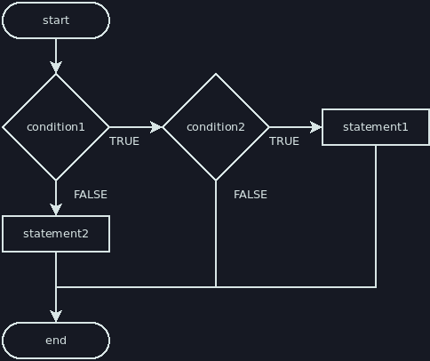
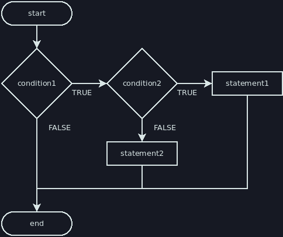

# Mistakes to Avoid

## Poor Indentation

You should always indent code nested within a code block, and you should indent
*consistently*. There's no set amount that you *have* to indent in Java, but
four spaces is pretty common. Whatever the space you use for one level of
indentation, this should be the same throughout your entire program. Consistent
formatting is important for keeping your code readable by a human.

Some examples of poor indentation:

```java
// No indentation
if (condition1) {
if (condition2) {
statement1;
} else {
statement2;
}
statement3;
}

// Inconsistent: some lines are indented and others are not
if (condition1) {
    if (condition2) {
        statement1;
} else {
    statement2;
}
statement3;
}

// Inconsistent: different numbers of spaces used for indentation
if (condition1) {
  if (condition2) {
      statement1;
   } else {
 statement2;
     }
     statement3;
}

// Inconsistent: first level indents 4 spaces, second level indents 2 spaces
if (condition1) {
    if (condition2) {
      statement1;
    } else {
      statement2;
    }
    statement3;
}
```

Below are examples of good indentation:

```java
if (condition1) {
    if (condition2) {
        statement1;
    } else {
        statement2;
    }
    statement3;
}

if (condition1) {
  if (condition2) {
    statement1;
  } else {
    statement2;
  }
  statement3;
}

if (condition1) {
        if (condition2) {
                statement1;
        } else {
                statement2;
        }
        statement3;
}
```

## Dangling Else

Aside from readability and their necessity in jshell scripts, another reason to
always include curly braces is to avoid creating a "dangling else":

```java
// Despite the indentation, both versions of this code are identical. How will
// it be interpreted by the computer?

// Version A
if (condition1)
    if (condition2)
        statement1;
else
    statement2;

// Version B
if (condition1)
    if (condition2)
        statement1;
    else
        statement2;

// If you would like to check this in a jshell script, you'll need to put
// everything on one line and replace the placeholders with actual code. Try it
// with each combination of true/false values for the conditions and try to
// determine whether version A or B is correct.
bool condition1 = true;
bool condition2 = true;
if (condition1) if (condition2) println("statement1"); else println("statement2");
```

The following two flowcharts show the difference in logic implied by the
indentation:

Version A:



Version B:



If you test this code, you'll see that version B describes what actually
happens. The else is attached to the closest if statement it can be attached to.
The fact that we have a rule for how to consistently interpret this makes it
unambiguous to the computer, but to a human it can be unclear how to interpret
this code. The use of curly braces and proper indentation removes all ambiguity,
makes it easier to read, and allows us to tell the computer to use either
interpretation:

```java
// If we meant for it to be interpreted as version A, curly braces can make this
// happen
if (condition1) {
    if (condition2) {
        statement1;
    }
} else {
    statement2;
}

// If we meant for it be interpreted as version B, curly braces clarify our
// intent
if (condition1) {
    if (condition2) {
        statement1;
    } else {
        statement2;
    }
}
```

### Version A vs Version B

If you had trouble determining whether version A or version B was correct
earlier, the following truth table may help. It shows what we should expect to
happen in version A compared to version B:

|condition1|condition2|Version A prints|Version B prints|
|:---:|:---:|:---:|:---:|
|true|true|statement1|statement1|
|true|false|*nothing*|statement2|
|false|true|statement2|*nothing*|
|false|false|statement2|*nothing*|

If you try each combination of truth values in jshell with no braces, you'll
observe the results predicted for version B.

## Variable Scope & Shadowing

Accidental [shadowing](../variables/scope.md#shadowing) is a common cause of
errors when writing if statements. Make sure you understand the difference
between declaring/initializing and reassigning variables so that you can avoid
this type of error.

A similar problem can occur if you declare a variable in the wrong scope. If you
want to initialize a variable inside of an if statement, it may be tempting to
declare it inside of the if statement. However, if you intend to use it outside
of the if statement, then this will not work. See the example in the section
covering [variable scope](../variables/scope.md).

If you want your if statement to initialize a variable, I recommend declaring it
before the if statement, then initializing it within the if statement. You will
also need to ensure your if statement or chain of else-ifs ends with an else
unless you assign a default value when first declaring the variable.

```java
// Initialize within if statement
int x;
if (condition1) {
    x = 1;
} else if (condition2) {
    x = 2;
} else { // must end in an else to ensure x is always initialized
    x = 3;
}

// Initialize with default value, then reassign within if statement
int x = 3;
if (condition1) {
    x = 1;
} else if (condition2) {
    x = 2;
} // no else required because we already initialized with default value of 3
```
