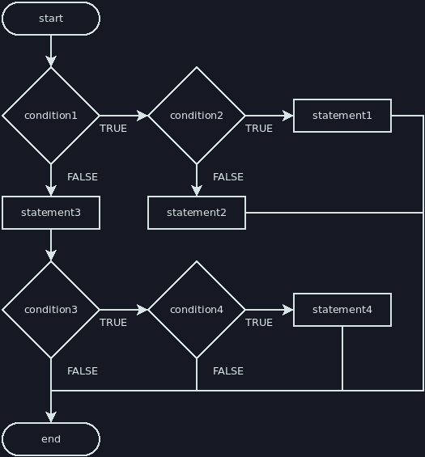

# Nested Ifs

We can write an if or if-else inside the body of an if or an else. A common term
for this is "nesting". Code nested within multiple code blocks should be
indented once for each code block:

```java
if (condition1) {
    if (condition2) {
        statement1; // nested twice
    } else {
        statement2; // nested twice
    }
} else {
    statement3; // nested once
    if (condition3) {
        if (condition4) {
            statement4; // nested thrice
        }
    }
}
```

A flowchart equivalent to the above code would look like this:



Some people dislike excessive nesting, and I personally find code easier to read
when nesting is kept to a minimum. However, it's a useful tool for combining
multiple if statements or other structures.
