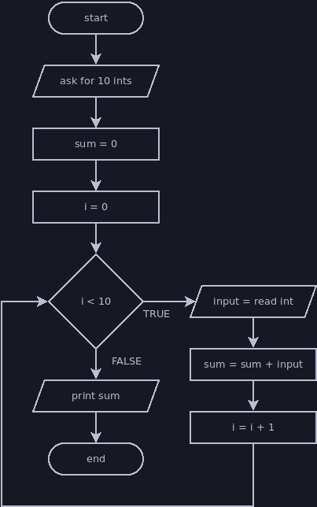

# Counting Loop

A counting loop repeats a set number of times, using a variable to count the
current number of repetitions. Counting loops are useful if you know how many
times you want your loop to execute its body, or if your program can calculate
the necessary number of repetitions before the loop begins.

It's usually preferable to use a [for loop](./for.md) when you want a counting
loop, but we'll introduce it using while loop syntax.

A counting loop will usually look something like this:

```java
// variable to track total repetitions
int count = 0;

// loop ends when we reach the total
while (count < totalRepetitions) {
    // whatever work the loop is supposed to do goes here
    ...

    // we usually increment our count variable at the end of the loop
    count = count + 1;
}
```

## Example: Count Down/Count Up

Printing a sequence of numbers is a suitable task for a counting loop. We can
count from 1 to 10 with the following loop:

```java
int count = 0;

while (count < 10) {
    println(count + 1);

    count = count + 1;
}
```

There are many ways we could structure this loop. This first example follows the
exact same pattern as the example, but there are different ways we could
simplify it:

```java
int count = 1;

while (count <= 10) {
    println(count);

    count = count + 1;
}
```

Since we want to print numbers from 1 to 10, not 0 to 9, we can change our
`count` value's range to be the exact numbers we're printing. It doesn't matter
if the counting loop starts counting at 0, or whether it counts up or down or by
increments other than 1. Go with whatever makes sense for the task at hand.

```java
int count = 0;

while (count < 10) {
    count = count + 1;

    println(count);
}
```

This loop increments the `count` variable before the print statement so that we
don't have to add one inside the print statement. I prefer to avoid moving the
increment step away from the end of the loop for a couple of reasons:
- If it's always at the end of the loop, it stands out and is easy to find.
- The value changes during that step, so any code referring to the `count` will
get a different value depending on whether it's before or after the increment
step.

This comes down to personal preference and sticking to familiar patterns to
lower the chances that I'll make a careless mistake.

I mentioned that a counting loop could count up or down, so let's take a look at
a loop that prints a countdown. I'll start off by forcing it to follow the
original template and make its variable count up from zero, then show a cleaner
version that adjusts the range to suit the task:

```java
int count = 0;

while (count < 10) {
    // We can do a bit of math to ensure we print a countdown even though our
    // count variable is increasing
    println(10 - count);

    count = count + 1;
}
```

```java
int count = 10;

while (count > 0) {
    // Now that the range is equal to the numbers we want to print and in the
    // order we want to print them, we can print the count directly
    println(count);

    count = count - 1;
}
```

There are two reasons that I prefer the second version:
- The code is slightly clearer because the range of numbers used for the count
is the same as the numbers we want to print.
- The top end of the range, 10 only appears once. Repeating code or information
is usually bad, because if we need to go back and change it we always have a
chance to introduce a bug by forgetting one of the copies we were supposed to
update.

The count up/count down loop isn't too complex, and there are many ways you can
adjust it. Try making it count by 2 or 3 instead of 1, or count through a range
of numbers entered by the user (for example, if the user typed 2 and 14, then
the loop would print the numbers 2 to 14).

## Example: Read Set Amount of Input

In the previous example, we needed to use the `count` variable in the task that
the loop is repeating. Sometimes we don't care about the value of `count` and
just want to repeat something a set number of times.

Try coding this program on your own before you look at my solution:
- Ask the user to enter ten integers, then print the sum after they enter the
last number.
- Your code should only include a single call to `nextInt()`. You could write
this program by writing `nextInt()` ten times, but the point is to use a loop.



Here's my solution:

```java
println("Please enter ten integers.");

int sum = 0;

// It's common practice to name count variables i
int i = 0;

while (i < 10) {
    int input = nextInt();
    sum = sum + input;

    i = i + 1;
}

println("The sum of your numbers is " + sum + ".");
```
