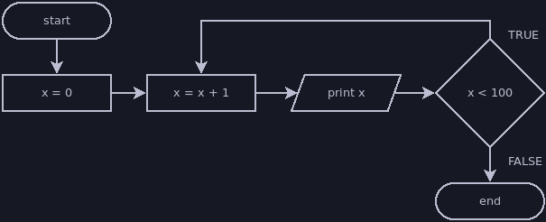

# Do-While Loop

A do-while loop is a slight variant of a while loop. It checks its condition at
the end of the loop rather than at the beginning, so it will always execute the
body at least once, even if its condition is initally false. Compare the
following code and flowchart to the [while loop](./while.md) flowchart to see
the difference:

```java
int x = 0;
do {
    x = x + 1;
    println(x);
} while (x < 100);
```



The structure of a do-while loop is similar to a while loop, with two small
differences:
- The loop begins with the `do` keyword and no condition
- We still use the `while` keyword, but after the loop's body, and there is a
semicolon after the condition

The do-while loop exists purely for convenience, and chance are you'll rarely
use it. It's worth using when it makes your code clearer or more concise, but
you can always use a standard while loop to accomplish the same thing.
