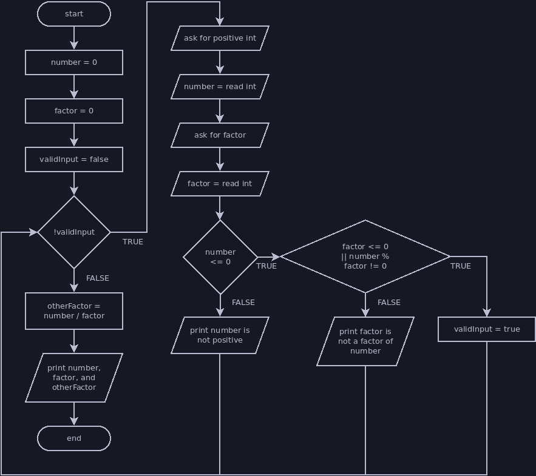

# Flag-Controlled Loops

A flag-controlled loop is a while loop that uses a boolean **flag** variable to
control when the loop ends rather than putting the logic in its condition. A
flag-controlled loop can simplify your loop's condition, remove duplicate code,
and make your code overall easier to read when used appropriately.

A flag-controlled loop will usually look something like this:

```java
// a boolean variable tells us whether to continue the loop
boolean flag = true;

// instead of using boolean logic in our condition, we check our flag value
while (flag) {
    // whatever work we want the loop to do goes here
    ...

    // at some point we need to check whether to change our flag value and end
    // the loop
    if (loopShouldEnd) {
        flag = false;
    }

    // we might do additional work after the flag check, but this would still
    // happen even if the flag is set to false

    // we can have multiple checks that potentially end the loop
    if (loopShouldEndForAnotherReason) {
        flag = false;
    }
}
```

## Example: Require Valid Input

Write a program that requires a user to enter a positive integer followed by a
factor of that integer. I recommend trying to write this program yourself
before viewing the solution. You can use the flowchart below as a guide, then
read a walkthrough of my solution after the flowchart.



```java
// Variables to store user input
int number = 0;
int factor = 0;

// Flag variable
boolean validInput = false;

// Loop repeats until flag is true
while (!validInput) {
    // Prompt for first input
    println("Please enter a positive integer.");
    number = nextInt();

    // Prompt for second input
    println("Please enter a factor of " + number + ".");
    factor = nextInt();

    // Check whether all input is valid
    if (number <= 0) {
        // Error message
        println(number + " is not positive!");
    } else if (factor <= 0 || number % factor != 0) {
        // Error message
        println(factor + " is not a factor of " + number + "!");
    } else {
        // Change flag to a value that will end the loop
        validInput = true;
    }
}

// The loop will only end when we have valid input, so we can proceed assuming
// factor is a factor of number.
int otherFactor = number / factor;
println(number + " can be factored into " + factor + " and " + otherFactor);
```

The code below functions identically to the flag-controlled loop, but it does
not use a flag variable.

```java
// Variables to store user input
int number = 0;
int factor = 0;

// Loop repeats until input is valid
while (number < 0 || factor < 0 || number % factor != 0) {
    // Prompt for first input
    println("Please enter a positive integer.");
    number = nextInt();

    // Prompt for second input
    println("Please enter a factor of " + number + ".");
    factor = nextInt();

    // Check whether all input is valid
    if (number < 0) {
        // Error message
        println(number + " is not positive!");
    } else if (factor < 0 || number % factor != 0) {
        // Error message
        println(factor + " is not a factor of " + number + "!");
    }
}

// The loop will only end when we have valid input, so we can proceed assuming
// factor is a factor of number.
int otherFactor = number / factor;
println(number + " can be factored into " + factor + " and " + otherFactor);
```

There are pros and cons to each version of the code:
- The flag condition (`!validInput`) is easier to read than the non-flag
condition (`number < 0 || factor < 0 || number % factor != 0`).
- The flag loop avoids duplicating the conditions between the loop and the if
statements. Duplicate code makes it easier to introduce errors: you have to
remember to change each copy if you modify the program, which is easy to forget.
- The version without the flag is more concise, which means there is less code
to read and fewer places for us to make mistakes.

When you're choosing how to structure your code, you should consider the
benefits and drawbacks of each approach. I would probably use a flag in this
case, but if we weren't including error messages we don't benefit much from a
flag variable:
- The duplicate code was in the if statements that print error messages, and
removing the error messages would mean neither version duplicates code.
- The flagless code would remove the if statements entirely, whereas the flag
code must include an if statement at the end just for breaking out of the
loop.

## Example: Reading a List

Write a program that reads a list of strings from the user, concatenating each
string into one long list string. When the user types "quit", print the list and
end the program. You should also try writing this one yourself using the
flowchart before you view the solution.


```java
// User input variable
String list = "List: ";

// Flag variable
boolean readingList = true;

// Loop repeats until flag is false
while (readingList) {
    // User input
    println("Enter an item for the list or \"quit\" to quit.");
    String input = nextLine();

    // Check for quit
    if (input.equalsIgnoreCase("quit")) {
        // Set flag to end loop
        readingList = false;
    } else {
        // Append input to list if it's not the quit command
        list = list + input + ",";
    }
}

// Remove the last comma from the list
// This isn't required by the flowchart, but it makes the output nicer
list = list.substring(0, list.length() - 1);

// Print the whole list
println(list);
```

Without the flag, our code would look like this:

```java
// User input variables
String input = "";
String list = "List: ";

// Loop repeats until user types quit
while (input.equalsIgnoreCase("quit")) {
    // User input
    println("Enter an item for the list or \"quit\" to quit.");
    input = nextLine();

    // Check for quit
    if (!input.equalsIgnoreCase("quit")) {
        // Append input to list if it's not the quit command
        list = list + input + ",";
    }
}

// Remove the last comma from the list
list = list.substring(0, list.length() - 1);

// Print the whole list
println(list);
```

Consider the pros and cons of each version of this program. Which do you prefer?
