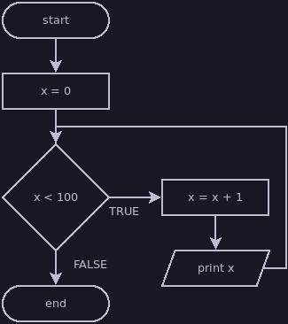

# While Loop

The first type of loop we'll loop at is called a `while` loop. This loop will
repeat its body for as long as some condition remains true. For example, if we
want to print the numbers 1 to 100, we can write a loop that adds 1 to a
variable and prints it for as long as that variable is less than 100.

```java
int x = 0;
while (x < 100) {
    x = x + 1;
    println(x);
}
```

This code is equivalent to the following flowchart:



## Structure of a While Loop

A while loop has the same structure as an if statement:
- The `while` keyword
- A condition (boolean expression) in parenthesis after the `while`
- A body (a code block enclosed within curly braces)

The [templates section](../templates.md#while-loop) shows this structure along
with another example loop.

The two differences between an if statement and a while loop are:
- The while loop repeats for as long as its condition is true, and the if
statement does not repeat (this is why we don't call an if statement an "if
loop").
- The while loop does not allow for an optional else when its condition is
false.

## Infinite Loops

Several common mistakes can create infinite loops, which are loops that will
never terminate on their own. When a program encounters an infinite loop, it
will remain stuck in the loop until the user forces the program to stop.

### Semicolon

One way to accidentally create an infinite loop is to place a semicolon after
the condition:

```java
while (condition); {
    statements;
}
```

This is similar to misusing semicolons after if statements, but the effect is
different. This creates an empty loop, which will never change its condition and
therefore never terminate (technically you could have such a loop terminate if
the condition were able to change on its own, but this isn't typical). Like the
if statement, the code shown above is equivalent to this:

```java
while (condition) {
    ; // empty statement
}

// unconditional code block, which would execute if we could ever reach it
{
    statements;
}
```

### Update Doesn't Match Condition

In most cases, this type of loop will technically terminate due to integer
overflow, but it'll take far longer than you intended. If you're counting up
with a condition that expects you to get below a certain value, or are counting
down with a condition that expects you to get above a certain value, then your
loop will not end until your counter variable overflows:

```java
int x = 100;
while (x > 0) {
    // This should be x = x - 1
    x = x + 1;
    println(x);
}
```

```java
int x = 1;
while (x <= 100) {
    // This should be x = x + 1
    x = x - 1;
    println(x);
}
```

### No Update Step

Many while loops have a statement that serves to update its condition. A good
example would be a [counting loop](./counting.md), which always has a statement
that increases or decreases its counting variable. If we forget this update step
in a loop that requires it, then the condition will always be true and the loop
will never terminate.

```java
int x = 0;
while (x < 10) {
    println(x);
    // we forgot to include x = x + 1;
}
```

### Accidental Shadowing

Like the semicolon problem, [accidental shadowing](
../variables/scope.md#shadowing) can occur in while loops the same way it occurs
in [if statement](../if/mistakes.md#variable-scope-and-shadowing). The result
will usually be an infinite loop if we shadow a variable used in the condition.
Fortunately, some forms of accidental shadowing are not valid syntax and will
produce a syntax error.

```java
int number = 0;
while (number < 1 || number > 10) {
    println("Please enter a number from 1 to 10.");
    // This will compile and cause an infinite loop because we're not
    // reassigning the original number variable
    int number = nextInt();
}
```

```java
int x = 0;
while (x < 10) {
    println(x);
    // This will not compile because we're declaring a new x variable while
    // using the old x to initialize it. Syntax errors are usually easier to fix
    // than other types of errors.
    int x = x + 1;
}
```
